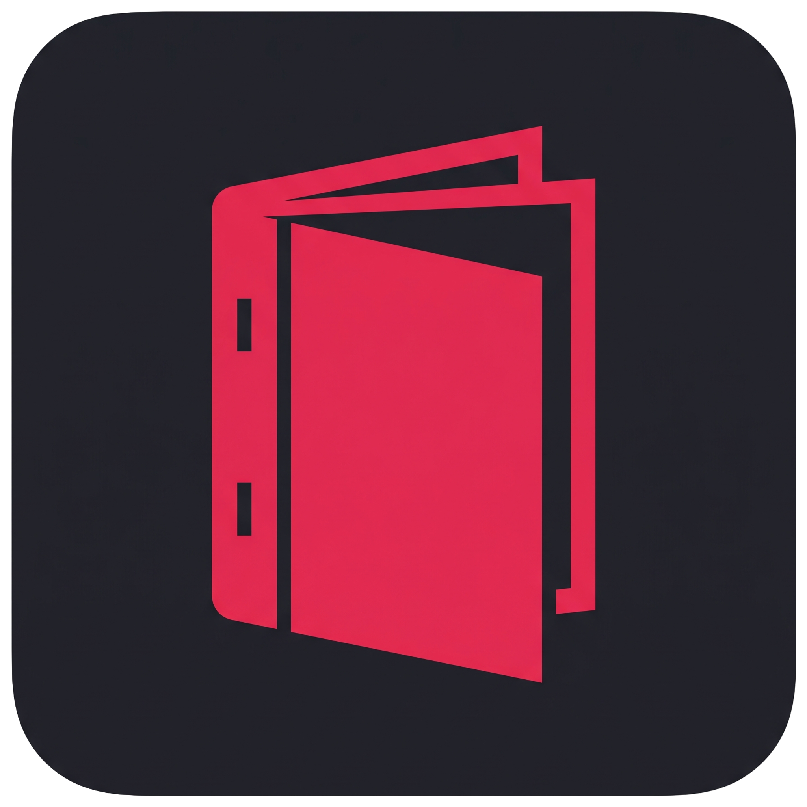
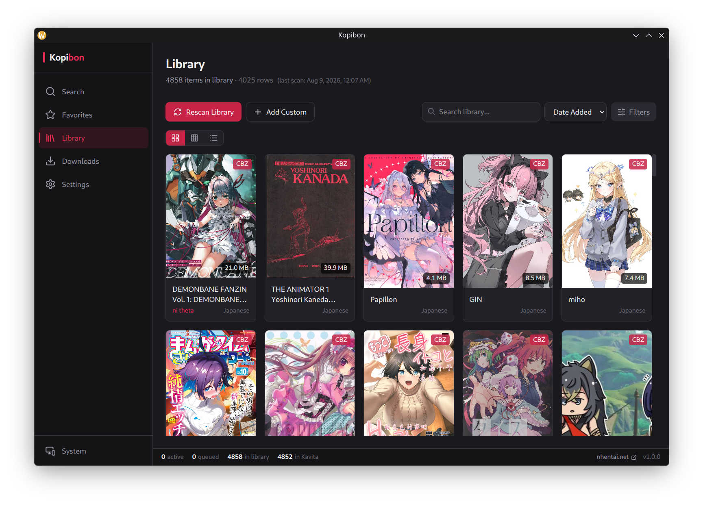
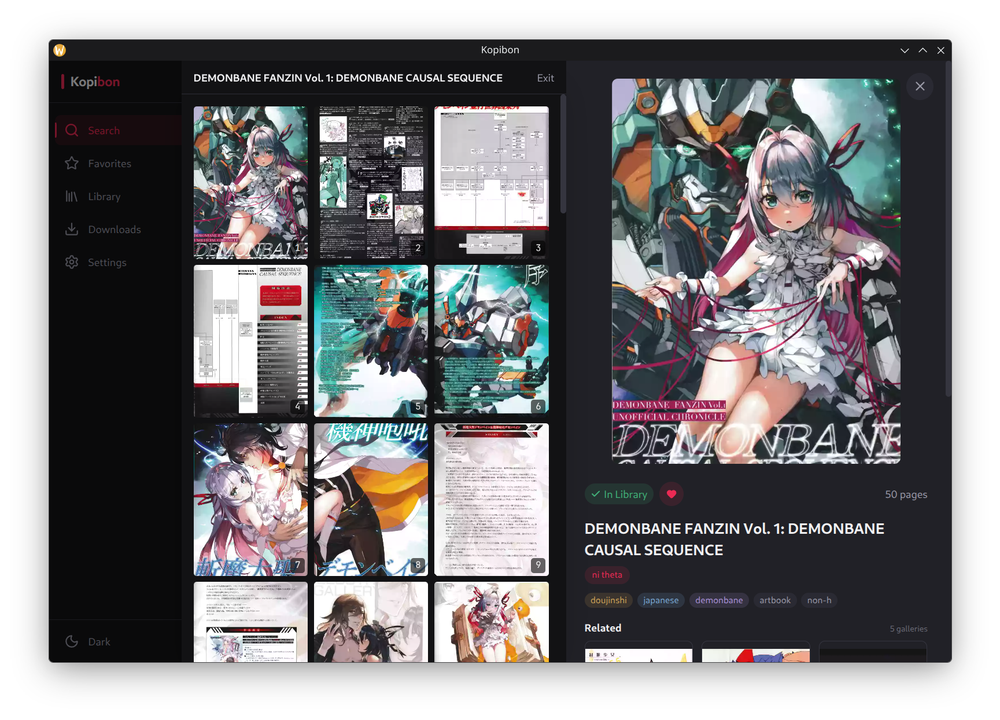
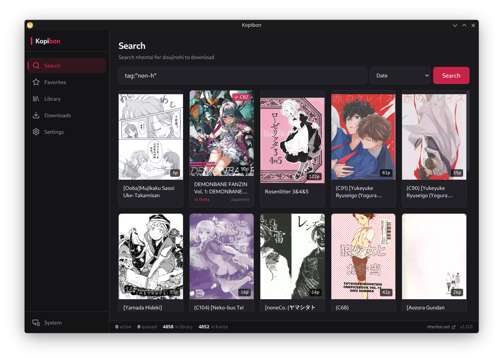
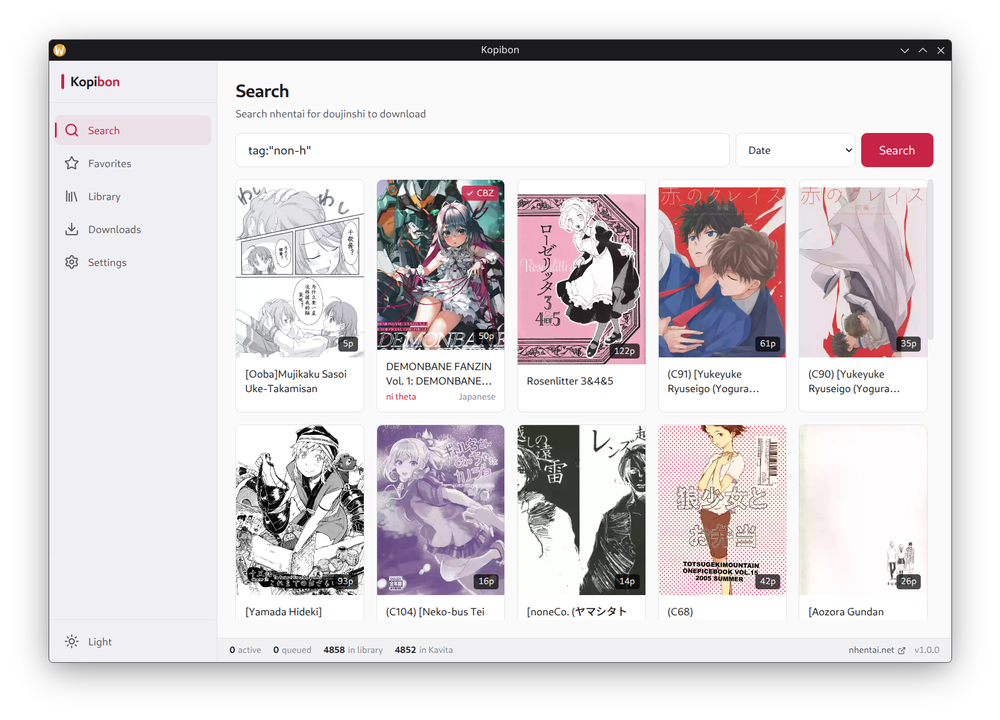

  

<h1 align="center">Kopibon</h1>

  A desktop app for downloading, managing and reading doujinshi from nhentai.
   
  Built with Electron, React and TypeScript. Runs on Linux and Windows.

  <a href="docs/getting-started/installation.md">Installation</a> ·
  <a href="docs/getting-started/nhentai-api-key.md">nhentai API key</a> ·
  <a href="docs/features/library.md">Library</a> ·
  <a href="docs/features/kavita-integration.md">Kavita</a>

---

## Features

### nhentai Search & Browse

- Full nhentai search with tag syntax (`artist:`, `tag:`, `-word` to exclude)
- Sort by date or popularity (all-time, today, week, month)
- Gallery detail with tags, artists, groups and related galleries
- In-app gallery viewer with keyboard navigation and CDN fallback

### Favorites

- Browse and search your nhentai favorites
- Favorite / unfavorite straight from the detail panel
- Un-favoriting removes the card from the list in place, keeping your place

### Library

- Scan existing PDF/CBZ collections and read the metadata back out
- Three view modes: grid, compact, and list with inline editing
- Search across title, artist, series, tags, filename and nhentai ID
- Filter by artist, series and tag with searchable multi-select dropdowns
- Series grouping with volume numbering and missing-volume detection
- Batch operations: delete, remove, convert, sync, select-all
- Custom entries for doujinshi that nhentai does not host

### Downloads

- Download as **PDF** or **CBZ**, with compression controls
- Configurable concurrency (1–8 simultaneous downloads)
- CDN server rotation when a server fails
- Re-downloading preserves your series and volume metadata

### Metadata

- `ComicInfo.xml` for CBZ, XMP + docinfo for PDF
- Kavita-compatible: Series, Number, Genre, Tags, SeriesGroup, StoryArc
- Calibre-compatible XMP namespaces
- Editable templates — change what gets written without touching code

### Kavita Integration (optional)

- Status indicators in the library and series detail
- Automatic series scans after metadata changes
- Delete mirroring
- Graceful degradation — everything works without it

### Readers

- Built-in PDF viewer with batched, memory-friendly rendering
- Built-in CBZ viewer with lazy page decoding and keyboard navigation
- Online gallery viewer for nhentai galleries

---

## Screenshots

  
  

  
  

<!-- TODO: replace the two search screenshots above with a single animated
     search.gif once it is produced. -->

---

## Getting Started

See [Installation](docs/getting-started/installation.md) for the requirements,
how to install and run the app, and how to build the packaged application from
source.

## Documentation

**Getting started:** [Installation](docs/getting-started/installation.md) ·
[nhentai API key](docs/getting-started/nhentai-api-key.md)

**Features:** [Downloading](docs/features/downloading.md) ·
[nhentai integration](docs/features/nhentai-integration.md) ·
[Library](docs/features/library.md) ·
[Metadata pipeline](docs/features/metadata-pipeline.md) ·
[Kavita integration](docs/features/kavita-integration.md) ·
[Conversion](docs/features/conversion.md) ·
[Search settings](docs/features/search-settings.md) ·
[Readers](docs/features/readers.md) · [Sync](docs/features/sync.md)

**Reference:** [Library layout](docs/reference/library-layout.md) ·
[Metadata formats](docs/reference/metadata-formats.md) ·
[External tools](docs/reference/external-tools.md)

## License

GPL-3.0-or-later. See [LICENSE](LICENSE).

This covers the source in this repository. It says nothing about the content
the app downloads, and it is not a statement about nhentai's terms of service.
