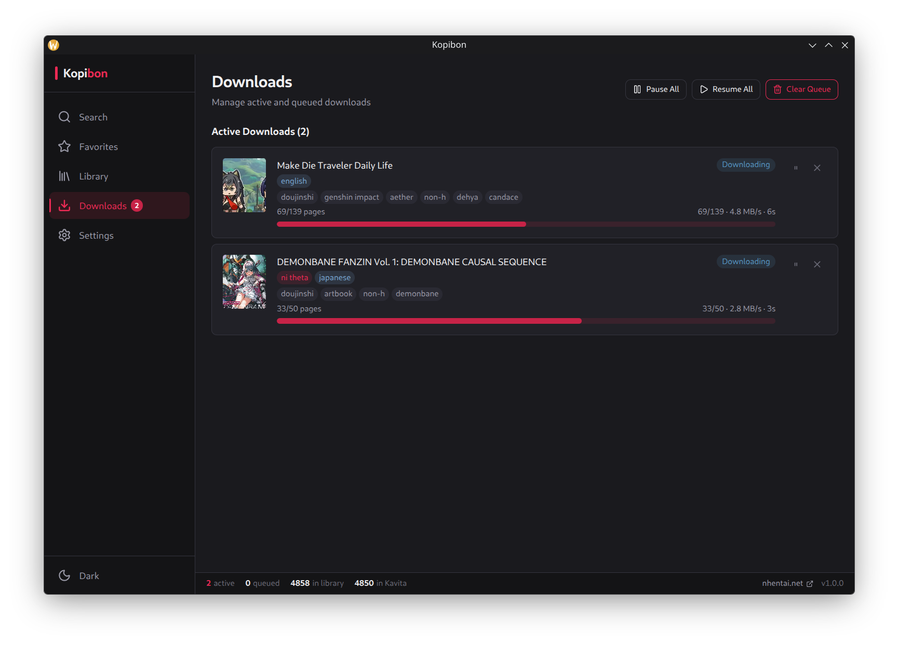

# Downloading

Downloading is the app's core function: you find a gallery in Search or
Favorites, add it to the queue, and the app fetches every page, assembles it
into a PDF or CBZ, embeds metadata, and drops the finished file into your
library. It is built to be patient and resumable. A queue can be paused,
cancelled, restarted after a crash, and it never loses the metadata you have
already set on a series.

## Output formats

Pick a **default format** in Settings → Downloads, and override it per gallery
from the download dialog.

| Format | Metadata | External tools | Best for |
| --- | --- | --- | --- |
| **PDF** | XMP packet + docinfo, in the format calibre and Kavita expect | Requires Python + pikepdf | General use, calibre libraries |
| **CBZ** | `ComicInfo.xml` v2.1 as the first archive entry | None | Kavita, Komga, ComicRack |

CBZ is the better choice if you use Kavita, because its `ComicInfo.xml`
separates genres and tags into distinct fields. In a PDF everything lands in
genres. See [`metadata-pipeline.md`](metadata-pipeline.md) for what actually
gets written.

## PDF compression

When downloading a PDF, Settings → Downloads → **PDF Compression** lets you
trade file size against quality:

- **Enable Image Compression**: re-encodes pages as JPEG (on by default).
- **Quality (1–95)**: higher is larger. Default 80.
- **Page Size**:
  - **Dynamic**: 1800px wide, height auto (default).
  - **Fit to Image**: keeps the original page dimensions.
  - **Letter** / **A4**: fixed paper sizes.
- **Black Background**: used for Letter/A4 so letterboxed pages blend in.

## Concurrency

The **Concurrency** slider (Settings → Downloads) sets how many galleries
download at once, from 1 to 8. Raising it starts more work immediately; the
default is 3. Each gallery's pages are fetched a few at a time in parallel,
regardless of this setting.

## Download workflow

A single download goes through these stages:

1. **Queue**: the gallery is added to the download table with a `queued`
   status, ordered by priority then age.
2. **Metadata fetch**: gallery info (title, tags, pages) is fetched from the
   nhentai API and cached, unless a usable copy is already in the database.
3. **Page fetch**: every page is downloaded from the nhentai CDN, rotating
   through servers on failure (see below).
4. **Worker assembly**: the page images are handed to a worker thread
   (`download-pdf.worker.js` or `download-cbz.worker.js`) that builds the file
   and a thumbnail.
5. **Metadata embed**: the worker writes XMP (PDF) or ComicInfo (CBZ) into the
   file, using your stored series and volume.
6. **Library insert**: the file is recorded in the library with its real page
   count and cover thumbnail.

A placeholder library entry shows **Downloading** in the UI while the gallery
is in flight. A failed download removes the placeholder, so nothing is left
half-presented.

## Re-downloads

Re-downloading a gallery you already own does not reset your metadata. The
existing series name and volume are read from the library before the new file
is built and carried into the new file's metadata. The previous file on disk is
removed only once the new one is written and recorded. So a failed
re-download leaves the old copy untouched.

## System notifications

A system notification fires when a download completes (Settings → Downloads →
**Show download notifications**, on by default). Batch operations such as sync
send their own completion notifications.

## CDN server rotation

nhentai serves images from several CDN hosts. The app fetches the live list
from `GET /cdn` and uses it to build page URLs. When a server fails:

- A **404** just moves to the next server (the image itself is missing).
- Any other error counts against that server. After **3 consecutive failures**
  the server is **demoted** to the end of the list, so reliable servers are
  tried first. A single success re-promotes it.

Interrupted downloads (a crash or hard quit) are re-queued automatically at
startup, and scratch files from the failed attempt are discarded.

## See also

- [Metadata pipeline](metadata-pipeline.md): what is written into each file
- [Library](library.md): what happens to a finished download
- [Conversion](conversion.md): turning PDF downloads into CBZ
- [nhentai integration](nhentai-integration.md): finding galleries to download
